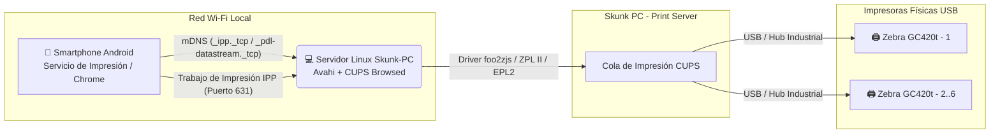

# 🖨️ Skunk PC: Servidor de Impresión Universal en Red (CUPS + Avahi / ZeroConf)

**Skunk PC** es una arquitectura e infraestructura automatizada diseñada para transformar un PC estándar con Linux (Debian 12, Ubuntu LTS o Linux Mint) en un **Servidor de Impresión Universal en Red (Print Server)** de alto rendimiento.

El objetivo principal es permitir que cualquier trabajador conectado a la red Wi-Fi desde un **Smartphone Android** (o cualquier dispositivo compatible con **AirPrint / Mopria / IPP**) pueda imprimir etiquetas térmicas directamente desde el navegador Chrome o una aplicación Web hacia un clúster de impresoras **Zebra GC420t (USB)** de forma nativa (**Plug & Play**), sin necesidad de instalar controladores ni aplicaciones de terceros.

---

## 🏗️ Arquitectura del Sistema



### Tecnologías Clave
* **CUPS (Common Unix Printing System):** Motor principal de colas, filtros y compartición por protocolo IPP (Puerto 631).
* **Avahi Daemon (`avahi-daemon` / mDNS):** Publica automáticamente registros ZeroConf (`_ipp._tcp.local`, `_pdl-datastream._tcp.local`) en la subred local para detección inmediata en Android.
* **Controladores Nativos / foo2zjs:** Compatibilidad nativa con los lenguajes térmicos **EPL2** y **ZPL II** de las impresoras Zebra GC420t.

---

## 📁 Estructura del Proyecto y Scripts de Automatización

El repositorio se divide en scripts modulares que cubren la instalación, configuración del firewall/IPP y autoconfiguración USB de las impresoras:

| Script | Descripción | Estado |
| :--- | :--- | :--- |
| `setup_printserver.sh` | **Paso 1:** Instalación de paquetes obligatorios (`cups`, `avahi-daemon`, `cups-browsed`, `foo2zjs`), configuración del grupo `lpadmin` e inicialización de servicios systemd. | ✅ Listo |
| `configure_cups_network.sh` | **Paso 2:** Configuración avanzada de `/etc/cups/cupsd.conf` para escucha en todas las interfaces, permisos por subred y directivas IPP/AirPrint. | ⏳ En desarrollo |
| `add_zebra_printers.sh` | **Paso 3:** Escaneo de puertos USB (`lpinfo -v`), registro automático o interactivo de hasta 6 impresoras Zebra GC420t con parámetros térmicos óptimos (203 DPI, 4x6"). | ⏳ En desarrollo |
| `diagnose_printserver.sh` | **Paso 4:** Diagnóstico completo, pruebas mDNS (`avahi-browse`), estado de colas y comandos de impresión de prueba con ZPL. | ⏳ En desarrollo |

---

## 🚀 Guía Rápida de Instalación en el PC Final

Una vez clonado este repositorio en la máquina Linux que actuará como Servidor de Impresión:

### 1. Clonar el Repositorio
```bash
git clone https://github.com/GerAjeno/Skunk-PC.git
cd Skunk-PC
```

### 2. Ejecutar el Paso 1 (Preparación Base e Instalación de Dependencias)
```bash
sudo ./setup_printserver.sh
```
*Este comando actualizará el sistema, instalará CUPS y Avahi, agregará tu usuario al grupo `lpadmin` y levantará los servicios.*

---

## 👥 Soporte y Contribuciones
Proyecto desarrollado con los más altos estándares de Ingeniería DevOps y Administración de Sistemas Linux para garantizar alta disponibilidad y cero mantenimiento en planta.
