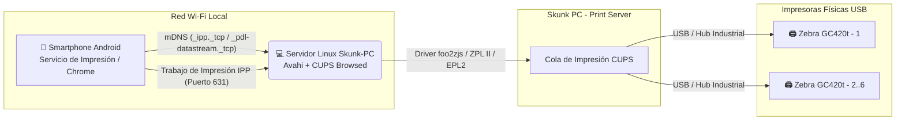

# 🖨️ Skunk PC: Servidor de Impresión Universal en Red (CUPS + Avahi / ZeroConf)

**Skunk PC** es una arquitectura e infraestructura automatizada diseñada para transformar un PC estándar con Linux (Debian 12, Ubuntu LTS o Linux Mint) en un **Servidor de Impresión Universal en Red (Print Server)** de alto rendimiento.

El objetivo principal es permitir que cualquier trabajador conectado a la red Wi-Fi desde un **Smartphone Android** (o cualquier dispositivo compatible con **AirPrint / Mopria / IPP**) pueda imprimir etiquetas térmicas directamente desde el navegador Chrome o una aplicación Web hacia un clúster de impresoras **Zebra GC420t (USB)** de forma nativa (**Plug & Play**), sin necesidad de instalar controladores ni aplicaciones de terceros.

---

## 🏗️ Arquitectura del Sistema



### Tecnologías Clave
* **CUPS (Common Unix Printing System):** Motor principal de colas, filtros y compartición por protocolo IPP (Puerto 631).
* **Avahi Daemon (`avahi-daemon` / mDNS):** Publica automáticamente registros ZeroConf (`_ipp._tcp.local`, `_pdl-datastream._tcp.local`) en la subred local para detección inmediata en Android.
* **Controladores Nativos / foo2zjs:** Compatibilidad nativa con los lenguajes térmicos **EPL2** y **ZPL II** de las impresoras Zebra GC420t.

---

## 📁 Estructura del Proyecto y Scripts de Automatización

El repositorio cuenta con un panel unificado y 4 scripts modulares secuenciales diseñados para ejecutarse de forma interactiva en la terminal del servidor final:

| Archivo / Script | Descripción |
| :--- | :--- |
| `skunk_manager.sh` | **Panel Centralizado (Dashboard):** Menú interactivo que orquesta y gestiona la ejecución completa de los 4 pasos, consulta de colas y lectura de guías sin salir de la terminal. |
| `setup_printserver.sh` | **Paso 1:** Instalación de paquetes obligatorios (`cups`, `avahi-daemon`, `cups-browsed`, `foo2zjs`), configuración de permisos en grupo `lpadmin` e inicialización de servicios systemd. |
| `configure_cups_network.sh` | **Paso 2:** Configuración avanzada de `/etc/cups/cupsd.conf` para escucha en todas las interfaces, permisos por subred Wi-Fi LAN y apertura de puertos en cortafuegos (631 TCP/UDP y 5353 UDP). |
| `add_zebra_printers.sh` | **Paso 3:** Escaneo de puertos USB (`lpinfo -v`), registro automático o interactivo de hasta 6 impresoras Zebra GC420t con parámetros térmicos optimizados y modo simulación/prueba. |
| `diagnose_printserver.sh` | **Paso 4:** Diagnóstico integral de servicios, auditoría de anuncios mDNS/IPP hacia Android (`avahi-browse`) y generación de etiquetas de prueba directas en lenguaje **ZPL II**. |
| `rename_printer.sh` | **Herramienta 5:** Cambiar el nombre de una impresora instalada en CUPS conservando su conexión USB y parámetros. |
| `change_network.sh` | **Herramienta 6:** Modificar dinámicamente la subred o IP de producción permitida en `cupsd.conf` cuando el servidor cambie de red. |
| `configure_labels.sh` | **Herramienta 7:** Configurar tamaño exacto de etiquetas térmicas (4x6", 2x1", mm) y modo térmico directo/transferencia. |
| `test_center.sh` | **Herramienta 8:** Centro interactivo de pruebas ZPL, códigos de barras, página nativa CUPS y calibración automática de sensor. |
| `fix_tlp2844.sh` | **Herramienta 11:** Diagnóstico profundo, reparación de permisos kernel/USB y pruebas hardware directas por cable en lenguaje **EPL2** para Zebra TLP2844. |
| `setup_watchdog.sh` (`skunk_watchdog.sh`) | **Herramienta 12:** Demonio Systemd (`skunk-watchdog.timer`) que inspecciona cada 30s colas detenidas por papel o cables USB y las desatasca automáticamente (`cupsaccept/cupsenable`). |
| `backup_restore.sh` | **Herramienta 13:** Módulo de recuperación ante desastres que empaqueta o restaura en `.tar.gz` todas las colas CUPS, PPDs y políticas para clonar servidores en segundos. |
| `tune_mdns.sh` | **Herramienta 14:** Afinamiento extremo de latencia mDNS/ZeroConf (`host-name-ttl=60`, rlimits, intervals) para que Android descubra impresoras en Wi-Fi en `< 1 segundo`. |
| `setup_webui.sh` (`skunk_webui.py`) | **Herramienta 15 (⭐ Web UI Dashboard):** Portal Web de Gestión en Flask (`http://IP_SERVIDOR:8080`) protegido por contraseña de seguridad (`Lasgarzas911`), con temas dinámicos **AMOLED Oscuro (#000000)** y **Modo Claro**, descarga/importación visual de respaldos con 1 Clic, calibración de sensores y pruebas térmicas EPL2/ZPL. |
| `TROUBLESHOOTING.md` | **Manual de Depuración:** Guía completa con soluciones a problemas comunes de subred, aislamiento Wi-Fi y políticas en móviles Android. |
| `PROXMOX_LXC_SETUP.md` | **Guía de Proxmox VE:** Instrucciones exactas para configurar red (bridge L2) y pasarela USB (Passthrough) hacia un Contenedor LXC Ubuntu Server. |

---

## 🌐 Interfaz Web de Administración (Web UI & Seguridad)

Además de la terminal, **Skunk PC** cuenta con un potente portal visual que se ejecuta de fondo en el puerto **8080** y puede ser consultado desde cualquier teléfono, tablet o computadora dentro de la subred de la planta:

* **Acceso URL:** `http://IP_DE_TU_SERVIDOR:8080`
* **Contraseña Predeterminada de Seguridad:** `Lasgarzas911` (protege todas las operaciones críticas y endpoints API contra modificaciones no autorizadas en la red).
* **Temas Dinámicos Inteligentes:**
  * 🌑 **Modo AMOLED Oscuro (`#000000` True-Black):** Apaga los píxeles OLED de dispositivos móviles para un máximo contraste en planta y ahorro de batería del 100%.
  * ☀️ **Modo Claro (Clean Slate):** Colores claros y nitidez óptima para monitores de escritorio en zonas iluminadas.
  * *Persistencia inteligente vía `localStorage` y cero destellos (Zero FOUC).*
* **Gestión & Respaldo a 1 Clic:**
  * **📦 Descargar Respaldo:** Crea un paquete `.tar.gz` con todas las colas, PPDs y ajustes Wi-Fi al instante.
  * **📤 Importar Respaldo:** Sube un archivo `.tar.gz` desde tu PC o celular y clona/restaura el servidor por completo en menos de 15 segundos sin tocar la consola.
* **Pruebas y Calibración Térmica:** Botones de testeo dual (**EPL2 / ZPL II**) y forzado de calibración de sensor de etiquetas con un solo toque.

---

## 🚀 Guía Rápida de Instalación en el PC Final

Una vez que tengas el PC con Linux en planta o almacén (o en Proxmox), simplemente abre una terminal y ejecuta:

### 1. Clonar el Repositorio
```bash
git clone https://github.com/GerAjeno/Skunk-PC.git
cd Skunk-PC
```

### 2. Ejecutar el Panel Unificado de Administración
```bash
sudo ./skunk_manager.sh
```
Desde este panel podrás ejecutar en orden los pasos **[1] -> [2] -> [3] -> [4]** o iniciar el portal web **[15]**.

---

## 📱 Guía Completa: Cómo Imprimir desde Teléfonos Android por Wi-Fi

El servidor Skunk PC traduce al instante imágenes y documentos de Android en comandos térmicos nativos (**EPL2** a 203 DPI para TLP2844 / **ZPL II** para GC420t). Para imprimir desde los teléfonos en planta:

### 📶 Requisito Previo (Red Wi-Fi)
El teléfono Android debe estar conectado a la **misma red Wi-Fi o subred LAN** en la que está conectado el servidor Proxmox / Skunk PC.

---

### ⭐ Método 1: Impresión Nativa de Android (Sin Instalar Ninguna App)
En teléfonos Android modernos (Android 9 hasta 15):
1. Abre **Google Chrome**, tu archivo PDF o tu sistema web corporativo.
2. Toca el menú de **tres puntos (`⋮`)** arriba a la derecha y presiona **Imprimir (`Print`)** (o Compartir -> Imprimir).
3. En la parte superior, toca el menú desplegable **"Seleccionar impresora"**.
4. El sistema descubrirá por **mDNS/ZeroConf** tu impresora (por ejemplo: **`Zebra_TLP2844 @ Skunk-PC`**). Toca sobre ella.
5. Ajusta el tamaño de papel (ej. `100x150mm`) en las opciones de flecha desplegable si es necesario.
6. Toca el botón amarillo/verde de **IMPRIMIR**. ¡La etiqueta saldrá impresa en menos de 1 segundo!

---

### ⭐ Método 2: Mopria Print Service (Recomendado para Operación Industrial Continua)
Si manejas teléfonos Android de diferentes marcas (Xiaomi, Samsung, Motorola), modelos antiguos o deseas una detección IPP de grado industrial ultrarrápida:
1. Instala gratis en el teléfono desde la Google Play Store la aplicación oficial: **[Mopria Print Service](https://play.google.com/store/apps/details?id=org.mopria.printplugin)**.
2. Abre la app una sola vez y asegúrate de que el servicio esté **Activado (`ON`)**.
3. Al pulsar **Imprimir** en Chrome o cualquier aplicación web, Mopria gestionará y mantendrá la conexión directa y estable con Skunk PC.

---

### 💡 Tip para Desarrolladores de Apps Web / WMS en Chrome
Si tu empresa desarrolla la aplicación web de almacén en HTML/JS, para evitar que el operario tenga que abrir los menús de Chrome, puedes enlazar un botón *"Imprimir Etiqueta"* con una sola línea de JavaScript:
```javascript
window.print();
```
¡Esto abrirá la ventana de impresión nativa de Android con la impresora Zebra preseleccionada y lista para confirmar con un toque!

---

## 👥 Soporte e Ingeniería

**Desarrollado por German Marambio © 2026**  
*Estructurado siguiendo prácticas de DevOps, Arquitectura de Redes Linux y Automatización de Sistemas para operación continua industrial en plantas de alta exigencia.*
