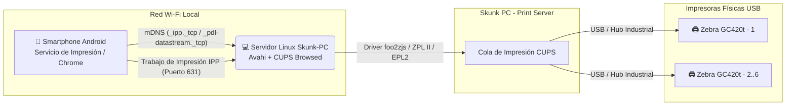

# 🖨️ Skunk PC: Servidor de Impresión Universal en Red (CUPS + Avahi / ZeroConf)

**Skunk PC** es una arquitectura e infraestructura automatizada diseñada para transformar un PC estándar con Linux (Debian 12, Ubuntu LTS o Linux Mint) en un **Servidor de Impresión Universal en Red (Print Server)** de alto rendimiento.

El objetivo principal es permitir que cualquier trabajador conectado a la red Wi-Fi desde un **Smartphone Android** (o cualquier dispositivo compatible con **AirPrint / Mopria / IPP**) pueda imprimir etiquetas térmicas directamente desde el navegador Chrome o una aplicación Web hacia un clúster de impresoras **Zebra GC420t (USB)** de forma nativa (**Plug & Play**), sin necesidad de instalar controladores ni aplicaciones de terceros.

---

## 🏗️ Arquitectura del Sistema



### Tecnologías Clave
* **CUPS (Common Unix Printing System):** Motor principal de colas, filtros y compartición por protocolo IPP (Puerto 631).
* **Avahi Daemon (`avahi-daemon` / mDNS):** Publica automáticamente registros ZeroConf (`_ipp._tcp.local`, `_pdl-datastream._tcp.local`) en la subred local para detección inmediata en Android.
* **Controladores Nativos / foo2zjs:** Compatibilidad nativa con los lenguajes térmicos **EPL2** y **ZPL II** de las impresoras Zebra GC420t.

---

## 📁 Estructura del Proyecto y Scripts de Automatización

El repositorio cuenta con un panel unificado y 4 scripts modulares secuenciales diseñados para ejecutarse de forma interactiva en la terminal del servidor final:

| Archivo / Script | Descripción |
| :--- | :--- |
| `skunk_manager.sh` | **Panel Centralizado (Dashboard):** Menú interactivo que orquesta y gestiona la ejecución completa de los 4 pasos, consulta de colas y lectura de guías sin salir de la terminal. |
| `setup_printserver.sh` | **Paso 1:** Instalación de paquetes obligatorios (`cups`, `avahi-daemon`, `cups-browsed`, `foo2zjs`), configuración de permisos en grupo `lpadmin` e inicialización de servicios systemd. |
| `configure_cups_network.sh` | **Paso 2:** Configuración avanzada de `/etc/cups/cupsd.conf` para escucha en todas las interfaces, permisos por subred Wi-Fi LAN y apertura de puertos en cortafuegos (631 TCP/UDP y 5353 UDP). |
| `add_zebra_printers.sh` | **Paso 3:** Escaneo de puertos USB (`lpinfo -v`), registro automático o interactivo de hasta 6 impresoras Zebra GC420t con parámetros térmicos optimizados y modo simulación/prueba. |
| `diagnose_printserver.sh` | **Paso 4:** Diagnóstico integral de servicios, auditoría de anuncios mDNS/IPP hacia Android (`avahi-browse`) y generación de etiquetas de prueba directas en lenguaje **ZPL II**. |
| `TROUBLESHOOTING.md` | **Manual de Depuración:** Guía completa con soluciones a problemas comunes de subred, aislamiento Wi-Fi y políticas en móviles Android. |
| `PROXMOX_LXC_SETUP.md` | **Guía de Proxmox VE:** Instrucciones exactas para configurar red (bridge L2) y pasarela USB (Passthrough) hacia un Contenedor LXC Ubuntu Server. |

---

## 🚀 Guía Rápida de Instalación en el PC Final

Una vez que tengas el PC con Linux en planta o almacén, simplemente abre una terminal y ejecuta:

### 1. Clonar el Repositorio
```bash
git clone https://github.com/GerAjeno/Skunk-PC.git
cd Skunk-PC
```

### 2. Ejecutar el Panel Unificado de Administración
```bash
sudo ./skunk_manager.sh
```
Desde este panel podrás ejecutar en orden los pasos **[1] -> [2] -> [3] -> [4]** con un solo clic o comando.

### Alternativa: Ejecución Manual Paso a Paso
Si prefieres ejecutar los scripts individualmente por terminal:
```bash
sudo ./setup_printserver.sh
sudo ./configure_cups_network.sh
sudo ./add_zebra_printers.sh
sudo ./diagnose_printserver.sh
```

---

## 🔬 Verificación de Conectividad con Smartphones Android
1. Conecta el teléfono Android a la **misma red Wi-Fi** que el servidor Skunk PC.
2. Abre Google Chrome en Android o cualquier aplicación compatible.
3. Presiona **Compartir -> Imprimir**.
4. En el selector de impresoras, verás aparecer automáticamente las colas del servidor (por ejemplo: `Zebra_GC420t_Caja_1 @ Skunk-PC`) con el icono de impresora en red.
5. ¡Presiona **Imprimir** y retira tu etiqueta térmica!

---

## 👥 Soporte e Ingeniería
Desarrollado y estructurado siguiendo prácticas de DevOps, Arquitectura de Redes Linux y Automatización de Sistemas para operación continua industrial.
