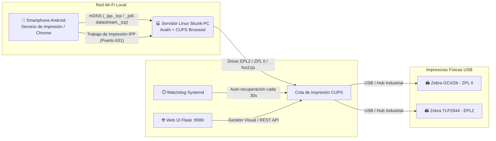

# 🖨️ Skunk PC: Servidor de Impresión Universal en Red (CUPS + Avahi / ZeroConf)

**Skunk PC** es una arquitectura e infraestructura automatizada diseñada para transformar un PC estándar con Linux (Debian 12, Ubuntu 22.04 a 26.04 LTS o Linux Mint) en un **Servidor de Impresión Universal en Red (Print Server)** de alto rendimiento.

El objetivo principal es permitir que cualquier trabajador conectado a la red Wi-Fi desde un **Smartphone Android** (o cualquier dispositivo compatible con **AirPrint / Mopria / IPP**) pueda imprimir etiquetas térmicas directamente desde el navegador Chrome o una aplicación Web hacia impresoras **Zebra GC420t (ZPL II)** y **Zebra TLP2844 (EPL2)** por USB de forma nativa (**Plug & Play**), sin necesidad de instalar controladores ni aplicaciones de terceros.

---

## 🏗️ Arquitectura del Sistema



### Tecnologías Clave
* **CUPS (Common Unix Printing System):** Motor principal de colas, filtros y compartición por protocolo IPP (Puerto 631).
* **Avahi Daemon (`avahi-daemon` / mDNS):** Publica automáticamente registros ZeroConf (`_ipp._tcp.local`, `_pdl-datastream._tcp.local`) en la subred local para detección inmediata en Android.
* **Soporte Térmico Dual:** Compatibilidad nativa tanto con el lenguaje **EPL2** (TLP2844) como con **ZPL II** (GC420t) a 203 DPI.

---

## ⚡ Instalación Completa en 1 Solo Comando

Para realizar la instalación integral de todos los paquetes base, configuración de red, inicio de la **Web UI (Puerto 8080)** y el **Demonio Watchdog**, abre la terminal en el PC de producción y ejecuta:

```bash
cd /home/ger/Skunk-PC
sudo bash setup_printserver.sh && sudo bash configure_cups_network.sh && sudo bash setup_webui.sh && sudo bash setup_watchdog.sh
```

---

## 📁 Estructura del Proyecto y Scripts de Automatización

| Archivo / Script | Descripción |
| :--- | :--- |
| `skunk_manager.sh` | **Panel Centralizado (Dashboard):** Menú interactivo que orquesta y gestiona la ejecución de todos los pasos y herramientas sin salir de la terminal. |
| `setup_printserver.sh` | **Paso 1:** Instalación de paquetes obligatorios (`cups`, `avahi-daemon`, `cups-browsed`, `foo2zjs`, `python3-flask`), configuración de permisos en grupo `lpadmin` e inicialización de servicios systemd. |
| `configure_cups_network.sh` | **Paso 2:** Configuración avanzada de `/etc/cups/cupsd.conf` para escucha en todas las interfaces, permisos por subred Wi-Fi LAN y apertura de puertos en cortafuegos (631 TCP/UDP y 5353 UDP). |
| `add_zebra_printers.sh` | **Paso 3:** Escaneo de puertos USB (`lpinfo -v`), registro automático o interactivo de impresoras Zebra GC420t/TLP2844 con parámetros optimizados. |
| `diagnose_printserver.sh` | **Paso 4:** Diagnóstico integral de servicios, auditoría de anuncios mDNS/IPP hacia Android (`avahi-browse`) y generación de etiquetas de prueba directas en **ZPL II / EPL2**. |
| `fix_tlp2844.sh` | **Herramienta 11:** Diagnóstico profundo, reparación de permisos kernel/USB y pruebas hardware directas por cable en lenguaje **EPL2** para Zebra TLP2844. |
| `setup_watchdog.sh` (`skunk_watchdog.sh`) | **Herramienta 12:** Demonio Systemd (`skunk-watchdog.timer`) que inspecciona cada 30s colas detenidas por falta de papel o cables USB y las desatasca automáticamente. |
| `setup_webui.sh` (`skunk_webui.py`) | **Herramienta 15 (⭐ Web UI Dashboard):** Portal Web de Gestión en Flask (`http://IP_SERVIDOR:8080`) protegido por contraseña (`Lasgarzas911`), temas dinámicos **AMOLED Oscuro (#000000)** y **Modo Claro**, respaldos `.tar.gz` a 1 Clic y calibración física. |
| `backup_restore.sh` | **Herramienta 13:** Módulo de recuperación ante desastres que empaqueta o restaura en `.tar.gz` todas las colas CUPS, PPDs y políticas para clonar servidores en segundos. |
| `tune_mdns.sh` | **Herramienta 14:** Afinamiento extremo de latencia mDNS/ZeroConf (`host-name-ttl=60`, rlimits, intervals) para que Android descubra impresoras en Wi-Fi en `< 1 segundo`. |
| `rename_printer.sh` | **Herramienta 5:** Cambiar el nombre de una impresora instalada en CUPS conservando su conexión USB y parámetros. |
| `change_network.sh` | **Herramienta 6:** Modificar dinámicamente la subred o IP de producción permitida en `cupsd.conf`. |
| `configure_labels.sh` | **Herramienta 7:** Configurar tamaño exacto de etiquetas térmicas (4x6", 2x1", mm) y modo térmico directo/transferencia. |
| `test_center.sh` | **Herramienta 8:** Centro interactivo de pruebas ZPL, EPL2, códigos de barras y calibración automática de sensor. |
| `delete_printer.sh` | **Herramienta 16:** Módulo interactivo de desinstalación limpia de colas en CUPS (`lpadmin -x`). |

---

## 🌐 Interfaz Web de Administración (Web UI & Seguridad)

* **Acceso URL:** `http://IP_DE_TU_SERVIDOR:8080` (ej. `http://192.168.1.26:8080`)
* **Contraseña Predeterminada de Seguridad:** `Lasgarzas911`
* **Temas Dinámicos Inteligentes:**
  * 🌑 **Modo AMOLED Oscuro (`#000000` True-Black):** Apaga los píxeles OLED de móviles para un máximo contraste en almacén y ahorro de batería.
  * ☀️ **Modo Claro (Clean Slate):** Diseñado para pantallas de escritorio.
* **Respaldo & Restaurado Visual (1 Clic):**
  * **📦 Descargar Respaldo:** Crea un archivo `.tar.gz` con todas las colas, PPDs y ajustes Wi-Fi al instante.
  * **📤 Importar Respaldo:** Permite restaurar o clonar un servidor completo en menos de 15 segundos.

---

## 📱 Guía Completa: Impresión desde Teléfonos Android por Wi-Fi

El servidor Skunk PC traduce al instante solicitudes de impresión desde Android en comandos térmicos nativos (**EPL2** a 203 DPI para TLP2844 / **ZPL II** para GC420t).

### ⭐ Método 1: Impresión Nativa de Android (Sin App Tercera)
1. Abre **Google Chrome**, tu archivo PDF o tu sistema web corporativo.
2. Toca el menú de **tres puntos (`⋮`)** -> **Imprimir (`Print`)**.
3. En el desplegable superior, selecciona tu impresora descubierta por mDNS (ej. **`Zebra_TLP2844 @ Skunk-PC`**).
4. Confirma el tamaño de etiqueta y presiona **IMPRIMIR**.

---

### ⭐ Método 2: Mopria Print Service (Recomendado para Producción Industrial)
1. Instala en los móviles desde la Google Play Store la app oficial: **[Mopria Print Service](https://play.google.com/store/apps/details?id=org.mopria.printplugin)**.
2. Asegúrate de que el servicio esté activo (`ON`). Mopria mantendrá la conectividad IPP ultrarrápida y estable.

---

## 👥 Soporte e Ingeniería

**Desarrollado por German Marambio © 2026**  
*Estructurado siguiendo prácticas de DevOps, Arquitectura de Redes Linux y Automatización de Sistemas para operación continua industrial.*
